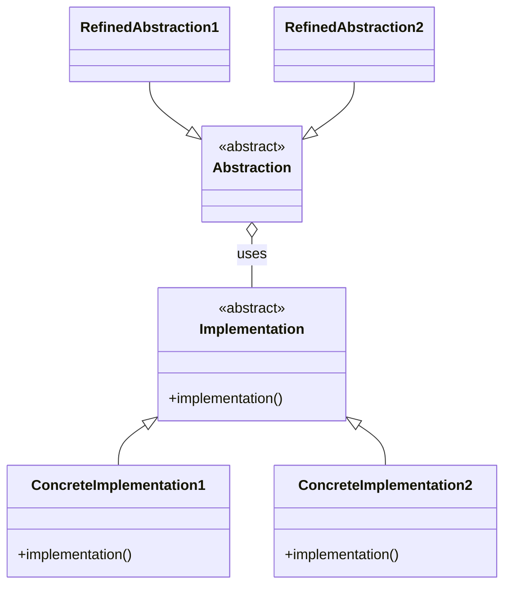

# Bridge Pattern with Python
Based on Arjan's [Let's Take The Bridge Pattern To The Next Level youtube video](https://www.youtube.com/watch?v=mM2-FPm1EhI)

Bridge is a structural design pattern that organizes closely related classes into two separate hierarchies: abstraction and implementation.



## Bridge Pattern with Protocol Class
```sh
python protocol/main.py
```

## Bridge Pattern with functions
```sh
python function/main.py
```

## Bridge Pattern with ABC Class
```sh
python abc/main.py
```
